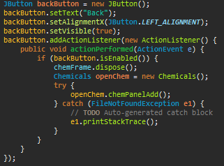
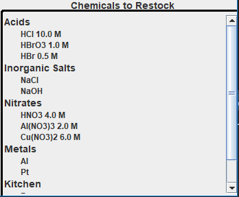

# Planning

**Defining the problem**

The client, Kathleen Rushing, is a teacher for several different levels of chemistry in Houston, Texas. Throughout each school year, her students participate in laboratory studies which use large amounts of chemicals.

Currently, she has no premeditated way of managing the amounts of the chemicals she has. Once she depletes her chemical supply, she must order more and may have a shortage of that chemical for a lab since she has multiple classes that do the same labs.

This unplanned system of managing chemicals is highly inefficient and creates situations in which chemicals may be unavailable when required for a lab. She would like to enter stock amounts and track the storage of chemicals in a program, allowing her to manage her chemicals in one location and prevent unintentional chemical deficits.

**Rationale for the proposed solution**

I decided that an interactable database would be the best solution for Mrs. Rushing&#39;s problem. Java would be the optimal coding language to make this database in because of its capability of object-oriented programming, allowing the user to have different subcategories under a central class, creating different behaviors of the program which is useful for having different chemical types as needed. The usage of Java would also allow for future expansion and the implementation of additional modules as needed. Because this solution does not require a relational database, there is no need for database software such as MS Access. Java also allows a better implementation of windows and features, making the program much more user friendly in the final product which is necessary as Mrs. Rushing is not very acquainted with technology.

**Success Criteria**

1. A login window that allows access only to the desired user, Mrs. Rushing.
2. A data entry window that allows Mrs. Rushing to enter new chemicals with current amounts and a restock threshold.
3. The product must have a user-friendly interface so Mrs. Rushing can easily access and maintain the database.
4. An on-screen section which displays all of the chemicals that currently need to be restocked.
5. An expandable area in which Mrs. Rushing can select a chemical type to view.
6. Tables separated by type that display individual chemicals, their stock, restock threshold, and unit type.
7. A method of adding more and removing from chemicals already stored in the stock.
8. A dynamic design that only uses parameters that are required for the chemical type (molarity may or may not be needed).
9. Easy to make backups of stock lists in case accidental deletion occurs.

# Design

The diagram below shows all of the major classes used in the project. The diagram is set up in a UML format for easier understanding.

  

The programs main() method is the entry point and it instantiates the GUI class. From there, the rest of the program runs, with the has-a relationship between Mainframe and Chemicals and Login.

**User Interface/General Flow**

  

The user is presented with a login screen. When correct credentials are inputted, they are presented with the Chemicals user interface, which is a subclass of the GUI Mainframe.

  

Once inside, they can choose a button to choose a chemical type, which will be a subclass of the Chemicals class, presenting with a display of the current stock in a table.

  

**Login**

The Login class allows the user to login to the program. Without successful authorization, the user will not be allowed to use the rest of the features of the program.

  

**File Storage Format**

The data inputted by the user will be stored in a .txt file, which can be easily accessed and created by Java. Each chemical type has its own stock file.

  

**Restock Algorithm**

After chemical values have been edited, the program will check if the current amount of chemical is below the restock threshold. If this is true, the user will see the chemical on the list of those needed to be restocked.

  

**Testing Plan**

1. Use a temporary username and password to login (&quot;test&quot; and &quot;test&quot;).
2. Input sample data using EditChemicals and its user interface.
3. Maintain a simple interface with streamlined buttons and functioning.
4. Lower some stock values to the restock threshold and some below the threshold. Observe the restockWarning panel
5. Add more JButtons for chemical types for future expansion if needed, ensuring that there is space and the simplicity of the program is maintained.
6. Check that only chemicals of their respective type appear in their respective table.
7. Add more chemicals using the JTable and remove chemicals using the EditChemicals GUI.
8. Ensure that chemical types that do not use molarity do not have a column for it in the JTable, maintaining simplicity and decluttering the program.

Make backups of the stock files and then use them in the program to ensure that they function correctly.

# Record of Tasks

| **Task Number** | **Planned Action** | **Planned Outcome** | **Time Estimated** | **Target Completion Date** | **Criterion** |
| --- | --- | --- | --- | --- | --- |
| 1 | First meeting with Mrs. Rushing | To find an idea by finding a current problem and discussing possible solutions. | 2 days | September 19, 2017 | A |
| 2 | First meeting with Computer Science teacher, Dr. Christopher | To approve the project and discuss possible solutions and how to improve upon them. | 2 days | September 22, 2017 | A |
| 3 | Discussion with Dr. Christopher | Discuss language usage and how the program is to be constructed. | 3 days | October 5, 2017 | A |
| 4 | Meeting with Mrs. Rushing | Approval of the proposed user interface, options, and flow of the program. | 2 days | November 1, 2017 | B |
| 5 | Finalize Criterion A with Success Criteria | To finish the planning phase of the solution with specific goals for success | 3 days | November 10, 2017 | A |
| 6 | Start Program Designing | Flowcharts for algorithms and hierarchical class structure | 1 week | November 27, 2017 | B |
| 7 | Coding GUI Mainframe | Produce a super class by which the GUI of the program is controlled | 2 weeks | December 25, 2017 | B/C |
| 8 | Coding Welcome/Login Screen | Produce an interactable user interface which allows only Mrs. Rushing to log in with predetermined credentials | 1.5 weeks | January 17, 2018 | C |
| 9 | Coding Chemicals GUI | Produce an interactable user interface in which Mrs. Rushing can have a general main screen for chemical selection | 1 week | January 25, 2018 | C |
| 10 | Creating the Database Through txt Files | To produce easy and intuitive files that can be read by the program and be backed up easily | 3 days | February 1, 2018 | B/C |
| 11 | Coding the Ability to Add New Chemicals | To append inputted user data into the database&#39;s text files for their respective chemical type | 2 weeks | February 20, 2018 | C |
| 12 | Coding the Ability to Remove Amounts from Current Chemicals | To read previously inputted data and rewrite the new data with the desired amount removed | 2 weeks | March 13, 2018 | C |
| 13 | Coding the EditChemicals User Interface | To present an intuitive user interface that allows Mrs. Rushing to easily edit chemical amounts | 1 week | March 23, 2018 | C |
| 14 | Coding the Chemical Display Method | To display the chemicals read from their stock file in their own table along with their respective data points | 2 weeks | April 5, 2018 | C |
| 15 | Coding the In Table Editing of Chemicals | To allow Mrs. Rushing to edit the data directly from the table, appending and rewriting the stock files as necessary | 2 weeks | April 23, 2018 | C |
| 16 | Coding the Restock Algorithm | To create an algorithm that reads stock data, searching for chemicals that need to be restocked | 1.5 weeks | May 5, 2018 | C  |
| 17 | Creating Restock Warning Interface | To create an interface that displays the chemicals that need to be restock | 5 days | May 12, 2018 | C |
| 18 | Finalize Code and Criterion C | Test out with test data and fix any bugs. Finish up development | 3 weeks | June 20, 2018 | C  |
| 19 | Testing the Final Product | Solution shown to Mrs. Rushing and tested with some of her test data | 1 week | September 6, 2018 | D |
| 20 | Interview with Mrs. Rushing | Gain feedback on the product, including suggestions for future improvements | 1 week | October 8, 2018 | A/E |
| 21 | Summarize Future Product Improvements | Write down the suggested improvements with possible solutions | 1 week | November 27, 2018 | E |
| 22 | Record Video to Demonstrate Functionality | Create a video that successfully documents the program&#39;s functions | 4 days | December 15, 2018 | D |
| 23 | Finalize Entire Solution | Reread the entire work and make sure it is ready to be turned in | 2 weeks | March 23, 2019 | A/B/C/D/E |

# Development

**Techniques Used:**

- Encapsulation
- User Interface
- Inheritance
- Searching for specified data in a file
- Parsing a text file
- Merging two or more sorted data structures
- Use of additional libraries
- Inserting data into an ordered sequential file
- Deleting data from a sequential file
- Implementing a hierarchical composite data structure
- Arrays of two or more dimensions

When the program is started initially, a GUI object is created. This is done by instantiating the GUI class.

This GUI object creates a window that is the initial window that the user is presented with. This splash includes a JButton. It is the baseline GUI which interacts with other classes, giving them variables such as screenSize.

  

The JButton has an action listener that, when the button is pressed, instantiates a Login object.

  

This Login object creates a window that presents the user with two JTextFields, Username and Password, which are compared to the stored username and password on file when the JButton Enter is pressed. If the usernames and passwords match, a Chemicals object is instantiated, however, if they do not match, the user is presented with an error asking them to reenter the correct details.

  
  

The instantiated Chemical object creates a window that presents several button options: Acids, Inorganic Salts, Nitrates, Metals, Kitchen, and Edit Chemicals.

  

When the EditChemicals JButton is pressed, an EditChemicals object is instantiated and the user is presented with a window in which they can add or remove chemicals.

  
  

When the Add Chemical JButton is pressed, a new panel is opened which presents the user with options for a chemical name, molarity, chemical type, amount, unit type, restock threshold, and add.

  
  

When the add button is pressed, a chemical object is created, and the inputted chemical is stored into a respective stock file through the designate and store methods.

  
  
  

The remove chemical button on the edit chemical panel creates a new frame and panel in which the user is prompted to select a chemical type. The FileWriter starts an instance in which the stock file can be written to using the PrintWriter, which actually writes/appends the data.

  

Choosing a chemical type will create a new frame and panel in which all of the chemicals of that type are presented through a JComboBox and the user can remove a specified amount.

  

Upon clicking the remove button, the entered amount and the current amount are differentiated and reinputted into the stock file. If they subtract to 0, the entire chemical line is deleted. If they subtract to less than 0, then the user is presented with a JOptionPane, indicating their error.

  

 The data can then be displayed when pressing one of the chemical type buttons on the general chemicals GUI. The data is read from the file into several arrays, including a two-dimensional array, using the Display method which are then transposed onto a table and displayed to the user. The arrays are dynamic in the sense that only certain chemical types use certain modifiers. For instance, kitchen won&#39;t use molarity, so the molarity values are 0, removing the Molarity column on the JTable. The arrays must be modified to reflect this.
 

  
  

The code produces the following user interface:

  

If the user attempts to click a chemical type button when there is no data created yet, they are presented with a JOptionPane indicating their error and the chemPanelAdd method is called again to reset the instance.

  
  

To make editing chemicals easier, the JTable is made editable in the Amount and Restock Threshold columns, as a TableModelListener can be used to detect changes. In this case, it is used to call the editChemicalsNoGUI method, which edits stock amounts without an interface. If the amount entered is negative, then a JOptionPane appears, indicating their mistake.

  

The editChemicalsNoGUI uses the column position and row position to navigate the array of inputted data, changing the data at the correct position, and then rewriting the data files with the new arrays using FileWriter and PrintWriter.

  

Returning to the general display screen, there is a JButton called &quot;Add&quot; which will allow the user to add a new chemical that is not on the list. This JButton calls the addChemicalTableButton method in the editChemicals class which is similar to the addChemical method, only removing the chemical type option as it is given based on which table is currently displayed.
 

  
  

When the add button is pressed in the addChemicalTableButton user interface, a new chemical is added to the stock list and the chemical display frame is disposed and remade so that the update can be seen added to the table.

  

To return to the home Chemicals screen, the back JButton is pressed, disposing the current frame and instantiating a new Chemicals object to get a fresh instance through an action listener.

  

The final part of the program resides in the RestockWarning class, which is a subclass of the Chemicals class to inherit values and methods. The displayRestockChem reads in the specified chemical type&#39;s stock file into a two-dimensional List and compares the current stock value and the restock threshold. If the restock threshold is higher than or equal to the current stock value, the name and molarity are added to an ArrayList called chemList.

  

This method is called for each chemical type and each list is added to a JPanel in a method called create. Inside this method, the panel is placed into a JScrollPane, so that if there is an excess of data, it can be scrolled through. This method is called from the Chemicals class and appears on the default Chemicals interface.

  
  

# Evaluation

**Success Criteria**

| A login window that allows access only to the desired user, Mrs. Rushing. | The Login class creates a login screen which allows a singular user to access the program.  Mrs. Rushing likes the execution of the login screen as only her credentials will work on it. She suggested possibly adding more usernames and passwords, allowing other teachers in her department to use the program. |
| --- | --- |
| A data entry window that allows Mrs. Rushing to enter new chemicals with current amounts and a restock threshold. | The EditChemicals frame and methods allows Mrs. Rushing to add new chemicals and remove from the current stock.  She finds this process effective when adding, though it is difficult to remove from multiple chemicals. |
| The product must have a user-friendly interface so Mrs. Rushing can easily access and maintain the database. | The Chemicals default screen is simple and uncluttered. It has five buttons for chemical types, a button for editing chemicals, and a section of chemicals that need to be restocked. Mrs. Rushing acknowledges that she is not very acquainted with technology, but the program is straightforward enough for her to use it. |
| An on-screen section which displays all of the chemicals that currently need to be restocked. | The RestockWarning class produces a sectioned off list that displays all of the chemicals and their molarities that need to be restocked on the default Chemicals frame. Mrs. Rushing finds it to be effective and simple. However, she thinks that the chemicals should be ordered by order of necessity (lowest current relative amount first). |
| An expandable area in which Mrs. Rushing can select a chemical type to view. | The five JButtons on the default Chemicals frame are simple and effective at displaying their respective chemical types. This can be expanded as more buttons can easily be added to encompass more chemical types for future expansion. Mrs. Rushing thinks the idea of expandability is good as she may think of more specific chemical types. |
| Tables separated by type that display individual chemicals, their stock, restock threshold, and unit type. | The JTables created by the Chemicals display method create an easy to read list of all of the data for that chemical type. Mrs. Rushing thinks the tables are effective for their purpose as they are simple to read and understand. |
| A method of adding more and removing from chemicals already stored in the stock. | The TableModelListener and removeChemical JButton provide alternate methods for removing and adding chemicals to those already in stock. Mrs. Rushing thinks the ability to edit in table is efficient as she can quickly edit a large amount of chemicals without pressing a series of buttons. |
| A dynamic design that only uses parameters that are required for the chemical type. | The JTable&#39;s column amounts adjusts to the chemical type and whether or not molarity applies to it. Mrs. Rushing likes that there is less clutter caused by the useless data, so the dynamic design is effective in its purpose. |
| Easy to make backups of stock lists in case accidental deletion occurs. | The stock files can easily be copied and pasted in a backup folder. Mrs. Rushing thinks that this method is fine, but it could be easier if there was an alternate method. |

**Recommendations for Further Development**

Move Database to a Network – After seeing the success of the product, Mrs. Rushing wants to share the program with her department members. Perhaps the program can be connected to an online network where multiple users can connect and edit the database as needed. This way, they can all use the same chemicals while still keeping the stock numbers correct.

Print Function – Mrs. Rushing likes to use physical paper for a lot of her work, so she would like a way to see the tables on paper. One archaic method of doing this is printing the txt files, but it is cluttered and difficult to read. A future development can be the inclusion of a print function that prints the JTables and the RestockPanel.

Backup Function – The idea of copying and pasting the stock files in an alternate location is an effective method of backing up, but for someone who isn&#39;t too acquainted with technology, this can be difficult to do. Instead, a future inclusion could be a function that uses the calendar and automatically makes backups every week or so.
